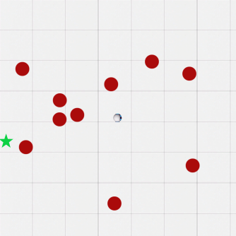
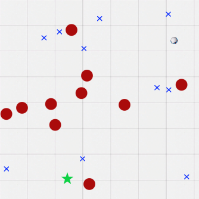
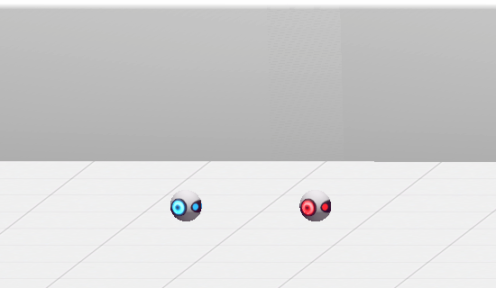

# IBM Verifiably Safe Reinforcement Learning framework

This repository contains implementions of Verifiably Safe Reinforcement Learning (VSRL) algorthms. To learn more about the motivation for this framework, check out our [web experience](https://vsrl-experiment.mybluemix.net/experiment).

## What is Verifiable Safety?

*Safe* reinforcement learning algorithms learn how to solve sequential decision making problems while continuously maintaining safety specifications (e.g., collision avoidance). These safety specifications are maintained throughout the entire training process.

*Verifiable safety* means that these safety constraints are backed by formal, computer-checked proofs. Formally verified safety constraints are important because *getting safety constraints correct is hard*.

For example, if a car at position `(car.x, car.y)` wants to avoid an obstacle at position `(obs.x, obs.y)`, the safety constraint `car.x != obs.x AND car.y != obs.y` is not sufficient! The car must instead correctly compute its braking distance based on a dynamical model of the car and the obstacle, so that it starts braking with sufficient lead time to ensure the car comes to a complete stop before reaching an obstacle.

Getting these braking distance calculations right is non-trivial. Getting safety constraints right on more difficult control problems is quite difficult. For that reason, hybrid systems theorem provers can provide computer-checked proofs that safety constraints are correct.

## Repository Structure

* `assets`: PNG images used to render the environments
  * `configs`: config files for each environment that can be used to train an object detector
* `scripts`: training scripts for the object detector and reinforcement learning
* `tests`: tests for various components of VSRL
* `vsrl`: the VSRL Python package
  * `parser`: parses for strings containing ODEs or similar mathematical expressions
  * `rl`: reinforcement learning agents and environments. We use the RL implementations from [`rlpyt`].
  * `spaces`: symbolic state spaces
  * `symmap`: for mapping from non-symbolic inputs (e.g. images) into a symbolic state space (e.g. object locations) over which safety constraints can be expressed
  * `training`: functions for training the detector / RL agents
  * `utils`: miscellaneous code
  * `verifier`: interfaces to formal methods tools that can be used to check the correctness of constraints, monitor modeling assumptions, etc.

## Getting Started

### Installation

If you want to run your models on GPUs, first follow the [PyTorch installation guide](https://pytorch.org/get-started/locally/)
 to get the correct version of PyTorch for your CUDA version (otherwise, our dependencies include a CPU-only version).
Then, install VSRL using pip:

```
git clone https://github.com/IBM/vsrl-framework.git
cd vsrl-framework
pip install .
# alternatively, pip install git+https://github.com/IBM/vsrl-framework.git
```

### Environments

We provide three environments to test VSRL:
* [goal finding](docs/goal_finding.md): the agent must avoid hazards and navigate to a a goal
* [robot vacuum](docs/pointmesses.md): the agent must clean messes up without breaking vases and then return to a charging station
* [adaptive cruise control](docs/acc.md): the agent must follow a leader vehicle at close but safe safe distance

See the [envs README](docs/envs.md) for futher details which are common to all environments.

Here are sample observations from each environment (rescaled) to get a feel for the setup.

<div align="center">
  
  
  
</div>

### Object Detection

In order to enforce safety constraints, we need to extract the positions of all safety-critical objects from the environment. To minimize data labelling, we just require at least one image of each object and at least one background image. The locations of these images are specified in a TOML file like so:

```toml
backgrounds = ["background.png"]

[objects]
agent = ["agent.png"]
hazard = ["hazard.png"]
goal = ["goal.png"]
```

(the paths should be absolute or relative to the TOML file)

We generate a dataset of potential observations from these images on-the-fly as we train the object detector. To start training, call

```bash
python scripts/train_detector.py --config_path <path_to_your_config_file> --save_dir <directory_to_save_models>
```

E.g. for the ACC environment, you might call

```bash
python scripts/train_detector.py --config_path assets/configs/ACC.toml --save_dir ~/models
```

Then the saved model will be in `~/models/vsrl/detector_ACC_0/checkpoints/`.

From within a script or notebook, you could instead do

```python
from vsrl.training import train_center_track
config_path = ... # e.g. the path to "assets/configs/ACC.toml"
save_dir = ... # e.g. "/home/user/models"
model = train_center_track(config_path, save_dir)
```

Load in a saved model like this

```python
from vsrl.symmap.detectors.center_track import CenterTrack

# replace this with your checkpoint
checkpoint_path = "/home/user/models/vsrl/detector_ACC_0/checkpoints/epoch=1.ckpt"
model = CenterTrack.load_from_checkpoint(checkpoint_path)
```

A config file for each of our environments is in `assets/configs`.

For more visually complex environments (e.g. in the real world), a good pre-trained object detector would be essential.

### Training VSRL Agents

The `scripts/train_rl.py` provides a convienant way of running training agents using VSRL:

```bash
python scripts/train_rl.py --env_name ACC --pbar true
```

### Verifying Constraints

Verification of constraints can be done using [KeYmaera X](https://github.com/Ls-Lab/KeYmaeraX-release) and copied into Python. You can also run KeYmaera X from VSRL using VSRL the python wrapper in the `verifier` directory. Although there is an interface that allows  direct use of controller monitors from KeYmaera X a strings, translating constraints into Python by hand is often necessary.

## Citing VSRL

The following BibTeX provides a canonical citation for VSRL:

```
@inproceedings{VSRL,
  author    = {Nathan Hunt and
               Nathan Fulton and
               Sara Magliacane and
               Trong Nghia Hoang and
               Subhro Das and
               Armando Solar{-}Lezama},
  editor    = {Sergiy Bogomolov and
               Rapha{\"{e}}l M. Jungers},
  title     = {Verifiably safe exploration for end-to-end reinforcement learning},
  booktitle = {{HSCC} '21: 24th {ACM} International Conference on Hybrid Systems:
               Computation and Control, Nashville, Tennessee, May 19-21, 2021},
  pages     = {14:1--14:11},
  publisher = {{ACM}},
  year      = {2021},
  url       = {https://doi.org/10.1145/3447928.3456653},
  doi       = {10.1145/3447928.3456653},
  timestamp = {Wed, 19 May 2021 15:10:46 +0200},
  biburl    = {https://dblp.org/rec/conf/hybrid/HuntFMHDS21.bib},
  bibsource = {dblp computer science bibliography, https://dblp.org}
}
```

The main components of VSRL are additionally described in several papers:

 * Nathan Hunt, Nathan Fulton, Sara Magliacane, Nghia Hoang, Subhro Das, Armando Solar-Lezama. [Verifiably Safe Exploration for End-to-End Reinforcement Learning](https://arxiv.org/abs/2007.01223). In Proceedings of the 24th ACM International Conference on Hybrid Systems: Computation and Control (HSCC 2021).
 * Nathan Fulton, Nathan Hunt, Subhro Das, Nghia Hoang. Formal Verification of End-to-End Learning in Cyber-Physical Systems: Progress and Challenges. NeurIPS-2019 Workshop on Safety and Robustness in Decision Making, Vancouver, BC, CA.
 * Nathan Fulton and André Platzer. [Verifiably Safe Off-Model Reinforcement Learning](https://arxiv.org/abs/1902.05632). Tools and Algorithms for the Construction and Analysis of Systems (TACAS’19), Held as part of the European Joint Conferences on Theory and Practice of Software (ETAPS’19).
 * Nathan Fulton and André Platzer. [Safe AI for CPS](https://ieeexplore.ieee.org/document/8624774). International Test Conference, ITC’18.
 * Nathan Fulton and André Platzer. [Safe Reinforcement Learning via Formal Methods: Toward Safe Control Through Proof and Learning](https://www.aaai.org/ocs/index.php/AAAI/AAAI18/paper/viewFile/17376/16225). Proceedings of the 32nd AAAI International Conference on Artificial Intelligence, AAAI’18, New Orleans, LA, USA.

## Key Contributors

 * Nathan Fulton nathan@ibm.com
 * Nathan Hunt nhunt@mit.edu

## License

This project is licensed under the terms of the MIT License.
See license.txt for details.

## Contact

 * [Issue Tracker](https://github.com/IBM/vsrl-framework/issues)
 * [Slack Channel](https://verifiablysaf-ost4334.slack.com)
