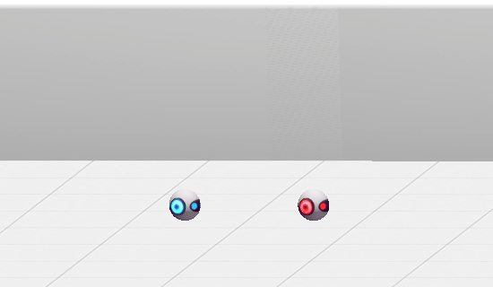

# Adaptive Cruise Control ([`ACC`]) Environment

This is the simplest environment as there is only a single action and the objects are in a 1D space (though visualized in 2D, the objects can only move horizontally). Optimizing reward requires getting close to an unsafe object, so the safety constraints provide a large amount of help in efficiently achieving reward-optimal behavior.

## Objects + Observations

<div align="center">
  
</div>

There are two objects: the leader robot (red) and the follower (blue) which is the agent.

### Vector Observations

* The relative velocity of the leader and follower

## Dynamics

The leader maintains a constant velocity. The agent is controlled by setting an acceleration `a`; its dynamics are `dv/dt = a`, `dx/dt = v`.

### Actions

* acceleration

## Safety

It is unsafe for the agent to crash into the leader. To avoid this, the agent must slow down if it is getting close to the leader with sufficient lead time (based on the agent's max deceleration).

## Rewards

If the agent goes off of the left edge of the screen or crashed into the leader, it receive a reward of -10. Otherwise, the reward is `1 - (agent_x - optimal_x) / width` where the optimal position is following one robot-length behind the leader and `width` is the width of the environment (so that the positive rewards are bounded in [0, 1]).

## Termination

The episode terminates when the agent goes off of the screen, collides with the leader, or after 1000 steps.

## Usage

```python
from vsrl.rl.envs import ACC

env = ACC()
obs = env.reset()
accel = 0.5
action = np.array([accel])
obs, reward, done, info = env.step(action)
```

[`ACC`]: ../vsrl/rl/envs/acc.py
