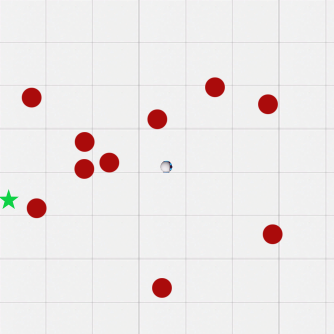

# Goal-finding ([`PMGoalFinding`]) Environment

This environment introduces more complicated dynamics for the agent and a 2D space. The agent doesn't necessarily need to be near an unsafe object to get high reward, so the safety constraints don't help as much in converging more rapidly to reward-optimal behavior.

## Objects + Observations

<div align="center">
  
</div>

There are three objects: the robot, which is the agent (gray with blue eyes, in the center); the hazards (red circles); and the goal (green star).

### Vector Observations

* robot velocity
* robot heading angle

## Dynamics

The goal and hazards are static. The agent is controlled by setting a forward acceleration `a` and a rotation velocity `w`. Its dynamics are

```
dx/dt = v * cos(theta)
dy/dt = v * sin(theta)
dv/dt = a
d(theta)/dt = w
```

### Actions

* forward acceleration
* rotational velocity

## Safety

It is unsafe for the agent to collide with a hazard. The agent can turn or slow down to avoid them.

## Rewards

If the agent goes off of the screen or crashes into a hazard, it receives a reward of -1. If it reaches the goal, it receives a reward of 10.

## Termination

The episode terminates when the agent goes off of the screen, collides with a hazard, reaches the goal, or after 1000 steps.

## Usage

```python
from vsrl.rl.envs import PMGoalFinding

env = PMGoalFinding()
obs = env.reset()
accel = 0.5
rot_vel = 0.5
action = np.array([accel, rot_vel])
obs, reward, done, info = env.step(action)
```

[`PMGoalFinding`]: ../vsrl/rl/envs/pm_goal_finding.py
